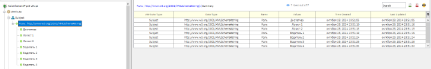
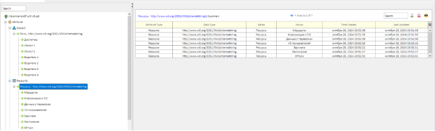
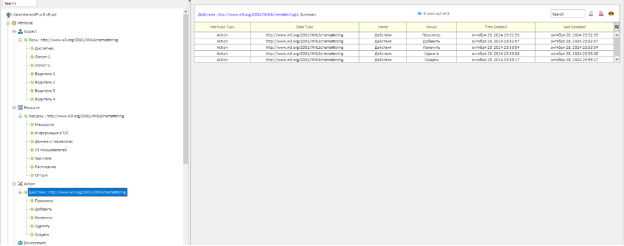
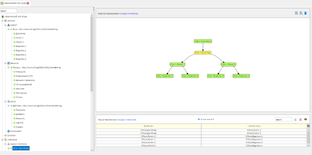
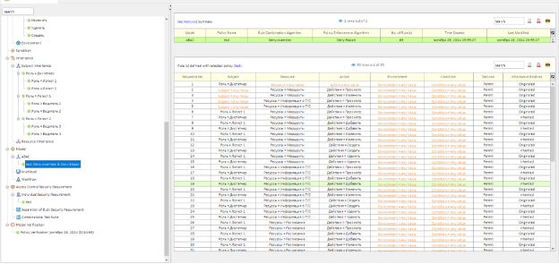
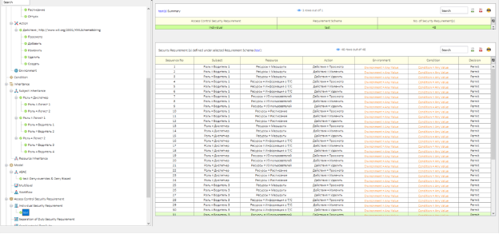
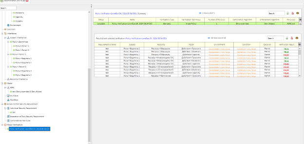

\# TOIB\_DZ3

PR3\_VAR 9

Задание 9

Дано:

Система трекинга грузовых автомобилей

Субъекты: диспетчер, менеджер по перевозкам (2 субъекта), водитель

(4 субъекта).

Объект: база данных системы трекинга грузовых автомобилей.

Задание: сформировать политику доступа субъектов к системе трекинга грузовых автомобилей.

Вопрос: Используя специализированное ПО Security Policy Tool, выясните может ли менеджер создавать новые и закрывать чужие треки?

1. Создание субъекта

   

1. Создание ресурсов

   

1. Cоздание действий 

   

1. Структура ролей

   

1. Настройка прав доступа

   

1. Индивидуальные требования безопасности 

   

1. Проверка 

   
